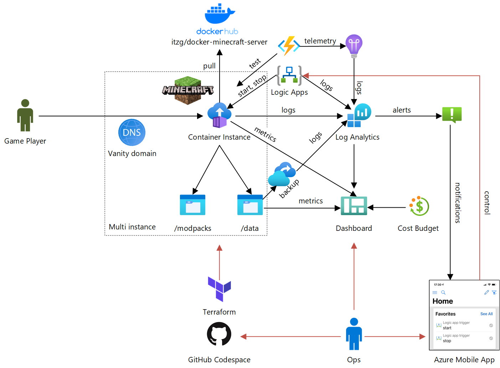
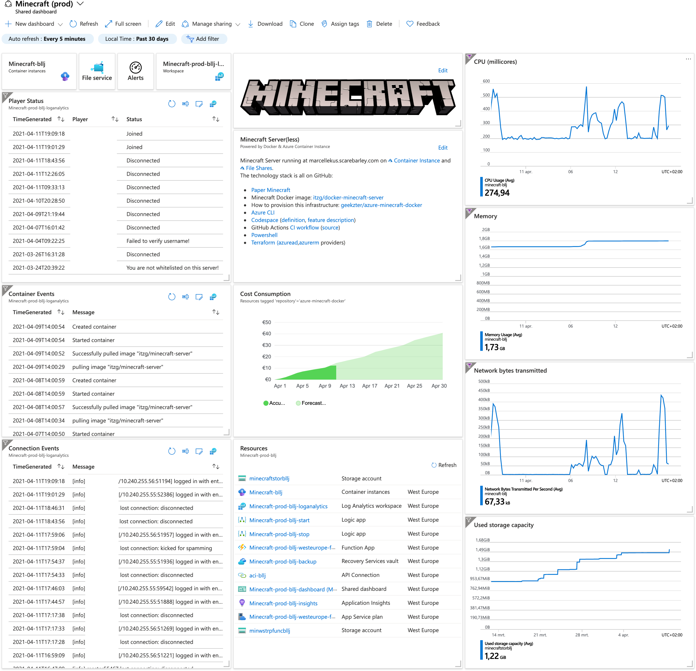

# Servidor Minecraft alimentado por Docker e Azure Container Instance
Este repositório implanta o [itzg/minecraft-server](https://hub.docker.com/r/itzg/minecraft-server) como uma [Azure Container Instance](https://azure.microsoft.com/en-us/services/container-instances/), usando o Terraform.

[](https://github.com/geekzter/azure-minecraft-docker/actions/workflows/ci-scripted.yml)
[](https://github.com/geekzter/azure-minecraft-docker/actions/workflows/ci-vanilla.yml)
[](https://github.com/geekzter/azure-minecraft-docker/actions/workflows/ci-dotnet.yml)



## Instruções
Existem duas maneiras de configurar isso:

### Configuração do Codespace
O método mais fácil é usar um [Codespace do GitHub](https://github.com/features/codespaces) (em beta). Basta criar um Codespace do GitHub no menu Code. Aguarde a conclusão do provisionamento do Codespace. Quando o Codespace tiver concluído o provisionamento e você abrir uma janela de terminal (Ctrl-`, Control-backquote), você deverá ver uma mensagem como esta:
```
Para provisionar a infraestrutura, certifique-se de estar logado com o Azure CLI, por exemplo, execute 'az login' e 'az account set --subscription 00000000-0000-0000-0000-000000000000'. Em seguida, faça o seguinte:
 - acesse o diretório /home/codespace/workspace/azure-minecraft-docker/terraform e execute 'terraform apply', ou
 - execute /home/codespace/workspace/azure-minecraft-docker/scripts/deploy.ps1 -apply
Para destruir a infraestrutura, substitua 'apply' por 'destroy' nos comandos acima.
```
Siga essas etapas para provisionar o Minecraft no Azure.

### Configuração local
Se você configurar isso localmente, certifique-se de ter os seguintes pré-requisitos:
- [Azure CLI](http://aka.ms/azure-cli)
- [PowerShell](https://github.com/PowerShell/PowerShell#get-powershell)
- [Terraform](https://www.terraform.io/downloads.html) (você pode usar [tfenv](https://github.com/tfutils/tfenv) no Linux e macOS, [Homebrew](https://github.com/hashicorp/homebrew-tap) no macOS ou [chocolatey](https://chocolatey.org/packages/terraform) no Windows)

No macOS, você pode executar `brew bundle` para instalar os pré-requisitos.

Depois de ter esses programas, você pode prosseguir e provisionar:
- Use o Azure CLI para SSO com o [Terraform](https://registry.terraform.io/providers/hashicorp/azurerm/latest/docs/guides/azure_cli): `az login`
- Selecione a assinatura a ser usada: `az account set --subscription 00000000-0000-0000-0000-000000000000`
- Inicialize o Terraform: `terraform init`
- Provisione a infraestrutura na nuvem: `terraform apply`

### Personalização
Você pode personalizar a implantação, substituindo os valores padrão das [variáveis de entrada do Terraform](https://www.terraform.io/docs/configuration/variables.html). A maneira mais fácil de fazer isso é copiar [config.auto.example.tfvars](./terraform/config.auto.example.tfvars) e salvá-lo como config.auto.tfvars.
- Use a matriz `minecraft_users` para definir os usuários permitidos para fazer login
- Use um nome DNS personalizado com `vanity_dns_zone_id` e `vanity_hostname_prefix`, usando um domínio gerenciado Azure DNS
- Quando as coisas ficarem sérias, você pode começar a fazer backup dos dados com `enable_backup`
- Se seus filhos estiverem estudando em casa no mesmo computador em que o Minecraft está instalado, configure a inicialização e desligamento automático durante os dias da semana com `enable_auto_startstop`, `start_time` e `stop_time`. Os gatilhos do Logic App criados podem ser favoritados no [aplicativo móvel](https://azure.microsoft.com/en-us/features/azure-portal/mobile-app/) para inicialização e desligamento sob demanda.
- Preocupado com mensagens de bate-papo aparecendo nos logs? `enable_log_filter` usa o [Console Spam Fix](https://dev.bukkit.org/projects/console-spam-fix) e o [configura](./minecraft/log-filter/config.yml) para ocultar mensagens de bate-papo nos logs. Esse recurso depende do [PowerShell](https://github.com/PowerShell/PowerShell) e é mais frágil na automação, mas atende a um requisito importante de privacidade.

Consulte [variables.tf](./terraform/variables.tf) para todas as variáveis de entrada.

## Painel
Após a provisão, um painel como este estará disponível no Portal Azure:


Você pode atualizar o painel no portal e recriar o [modelo](./terraform/dashboard.tpl) usando [templatize_dashboard.ps1](./scripts/templatize_dashboard.ps1).

## Recursos
- [itzg/minecraft-server](https://hub.docker.com/r/itzg/minecraft-server) no Docker Hub
- [docker-minecraft-server](https://github.com/itzg/docker-minecraft-server) no GitHub
- [Minecraft no Azure Friday](https://www.youtube.com/watch?v=2D8FTi-Zvt0) (usa o fluxo de trabalho do Docker CLI)
- [Minecraft no Blog do Docker](https://www.docker.com/blog/deploying-a-minecraft-docker-server-to-the-cloud/) (usa o fluxo de trabalho do Docker CLI)
